# Лабораторная работа №10
## Docker: создание образов и запуск контейнеров (по всем пунктам задания)

**Выполнил:** Анисимов Тимур  
**Группа:** ИКС-431  
**Дата:** 01 мая 2026 г.

---

## Цель работы

Отработать полный цикл работы с Docker по заданию:
1. собрать и запустить простой web-образ (`psweb`);
2. собрать и запустить дополнительный образ для R Shiny-приложения (`memory-hex`);
3. показать работу контейнеров в браузере;
4. выполнить очистку созданных ресурсов;
5. оформить отчет со скриншотами команд и результатов.

---

## Пункт 1. Простая сборка образа и запуск контейнера (проект `psweb`)

### 1.1 Клонирование проекта

```bash
git clone https://github.com/nigelpoulton/psweb.git
cd psweb
```

Скачали исходный код приложения и перешли в каталог проекта.

**Скриншот:**
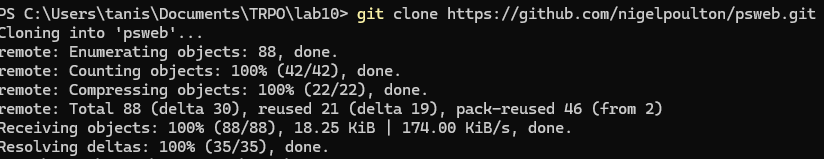

### 1.2 Сборка образа

```bash
docker build -t example:latest .
```

Собрали Docker-образ из `Dockerfile` проекта `psweb`.

**Скриншот:**
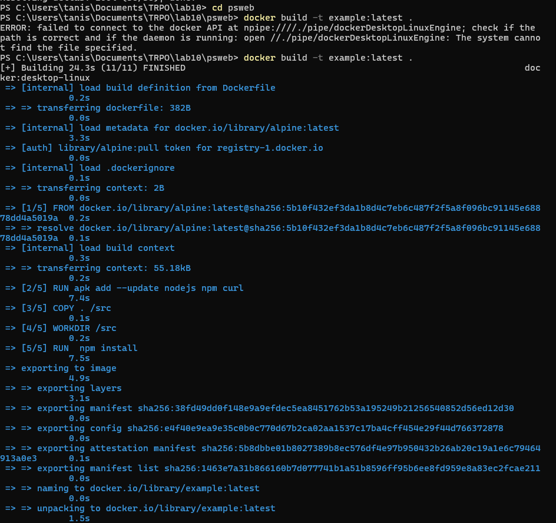

### 1.3 Просмотр образов

```bash
docker images
```

Проверили, что образ `example:latest` появился в локальном списке.

**Скриншот:**
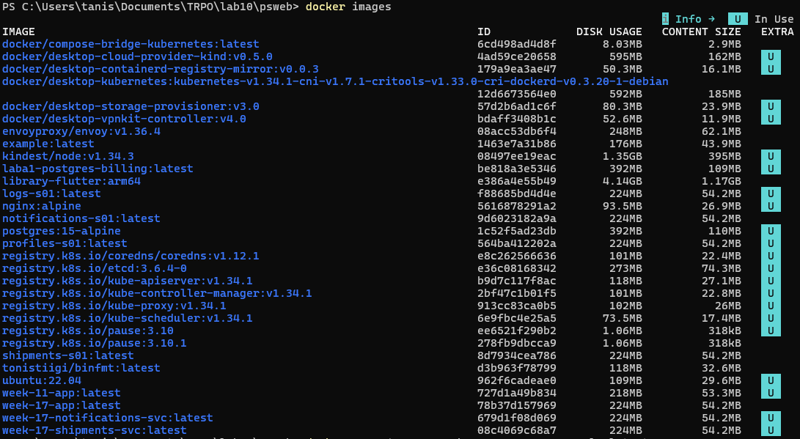

### 1.4 Запуск контейнера

```bash
docker run -d --name web -p 8081:8080 example:latest
```

Запустили контейнер в фоновом режиме и пробросили порт `8081` хоста на `8080` контейнера.

**Скриншот:**
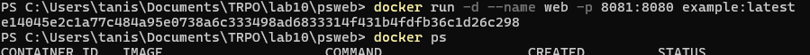

### 1.5 Просмотр запущенных контейнеров

```bash
docker ps
```

Убедились, что контейнер `web` находится в статусе `Up`.

**Скриншот:**
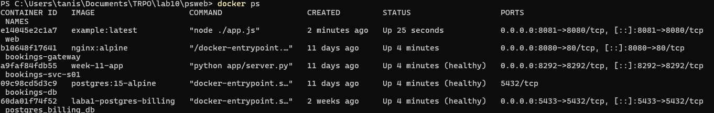

### 1.6 Проверка в браузере

Открыли:

```text
http://127.0.0.1:8081
```

Приложение работает корректно.

**Скриншот:**
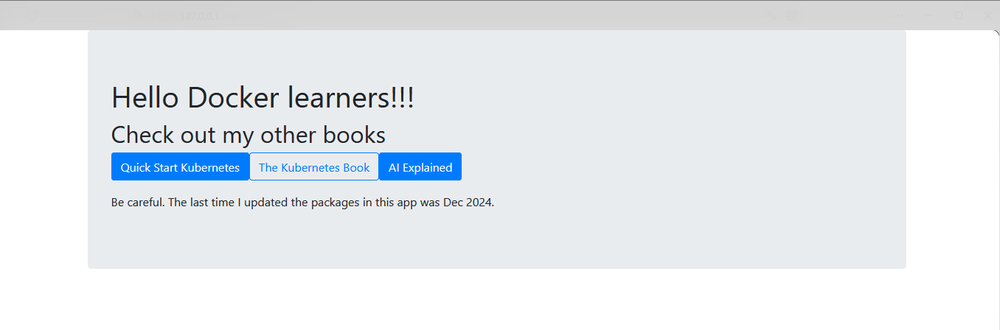

### 1.7 Очистка ресурсов

```bash
docker rm -f web
docker rmi example:latest
```

Удалили контейнер и собранный образ по завершении пункта.

**Скриншот:**
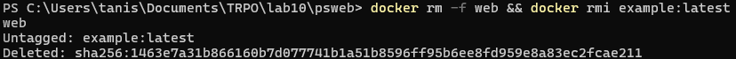

---

## Пункт 2 (дополнительно). Сборка образа для R Shiny (`memory-hex`)

### 2.1 Клонирование проекта

```bash
cd ..
git clone https://github.com/dreamRs/memory-hex.git
cd memory-hex
```

Скачали проект Shiny-игры `memory-hex`.

**Скриншот:**
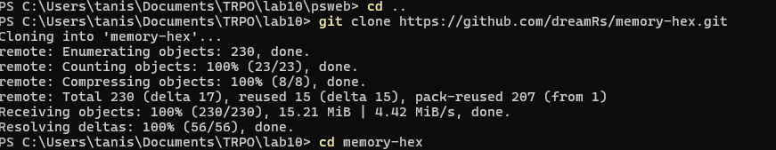

### 2.2 Dockerfile для Shiny-приложения

В проекте используется Dockerfile на базе `rocker/shiny:latest`.

**Скриншот Dockerfile:**
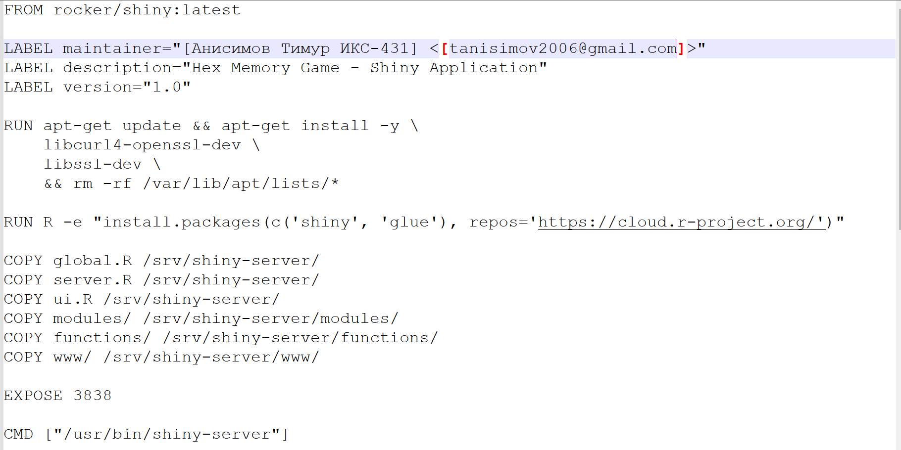

### 2.3 Как работает Dockerfile (по шагам)

1. `FROM rocker/shiny:latest` — берется готовый базовый образ с R и Shiny Server.
2. `LABEL ...` — добавляются данные об авторе, версии и назначении.
3. Устанавливаются системные зависимости (`libssl-dev`, `libcurl4-gnutls-dev`, `curl`).
4. В контейнер копируется `Rprofile.site` в `/etc/R`.
5. Через `install2.r` ставятся R-пакеты (`shiny`, `glue`).
6. Настраивается русская локаль (`ru_RU.UTF-8`).
7. Копируются файлы приложения в `/srv/shiny-server`:
   - `global.R`, `ui.R`, `server.R`
   - каталоги `modules/`, `functions/`, `www/`
8. Подключается конфигурация сервера:
   - `shiny-server.conf` → `/etc/shiny-server/shiny-server.conf`
9. Создается пользователь `shiny`, выдаются права на каталог приложения.
10. Открывается порт `3838`, приложение стартует командой `shiny-server`.

### 2.4 Как работает `shiny-server.conf` (server.conf)

Конфиг определяет поведение Shiny Server:

- `run_as shiny;` — запуск от непривилегированного пользователя `shiny`.
- `listen 3838;` — прослушивание порта `3838` внутри контейнера.
- `location / { site_dir /srv/shiny-server; ... }` — корневой каталог приложения.
- `log_dir /var/log/shiny-server;` — путь логов сервера.
- `directory_index on;` — включен индекс каталогов.

Итог: при обращении к `/` сервер отдает приложение из `/srv/shiny-server`.

### 2.5 Как работает `Rprofile.site`

`Rprofile.site` используется для стабильной и воспроизводимой сборки:

1. Фиксирует CRAN-зеркало:
   - `options(repos = c(CRAN = "https://cloud.r-project.org"))`
2. Настраивает HTTP User-Agent для R:
   - `options(HTTPUserAgent = ...)`

Это исключает интерактивный выбор зеркала и уменьшает вероятность проблем при установке пакетов в Docker-сборке.

### 2.6 Сборка образа

```bash
docker build -t ggweb:latest .
```

Собрали образ Shiny-приложения `ggweb:latest`.

**Скриншот:**
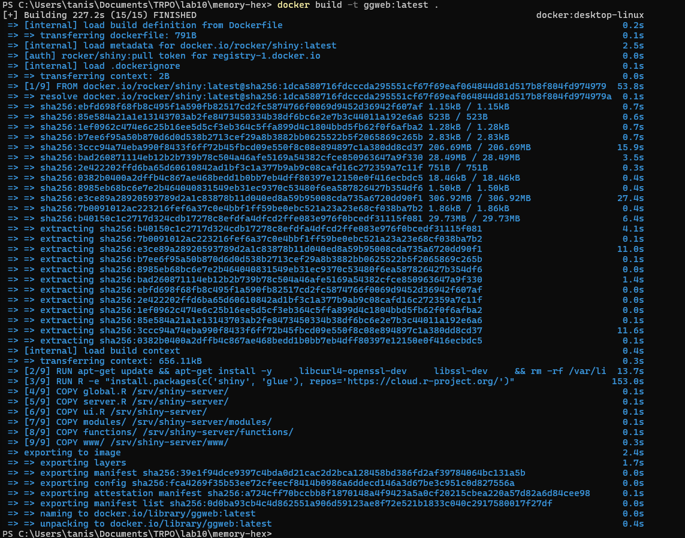

### 2.7 Запуск контейнера

```bash
docker run -d --name web2 -p 8082:3838 ggweb:latest
```

Запустили контейнер `web2`, опубликовали порт `8082` хоста на `3838` контейнера.

**Скриншот:**
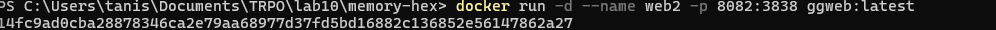

### 2.8 Проверка контейнера

```bash
docker ps
```

Контейнер `web2` работает.

**Скриншот:**
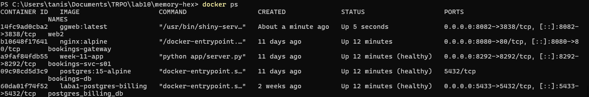

### 2.9 Проверка приложения в браузере

Открыли:

```text
http://127.0.0.1:8082
```

Shiny-приложение запустилось и доступно через браузер.

**Скриншот:**
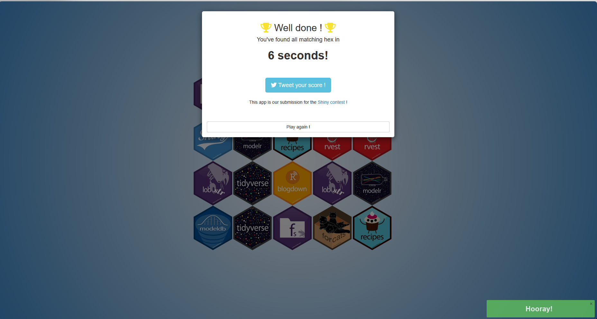

### 2.10 Очистка ресурсов

```bash
docker rm -f web2
docker rmi ggweb:latest
```

Удалили контейнер и образ второй части.

**Скриншот:**
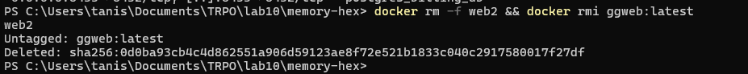

---

## Итоги по всей лабораторной работе

Выполнены все пункты задания:
- собран и запущен базовый web-контейнер (`example:latest` → `web`);
- собран и запущен дополнительный контейнер с R Shiny (`ggweb:latest` → `web2`);
- продемонстрирована работа обоих приложений в браузере;
- выполнена очистка контейнеров и образов;
- отчет оформлен с опорой на все имеющиеся скриншоты команд и результатов.

### Основные команды, использованные в работе

| Команда | Назначение |
|---|---|
| `git clone <repo>` | Клонирование исходного проекта |
| `docker build -t <name:tag> .` | Сборка Docker-образа |
| `docker images` | Просмотр локальных образов |
| `docker run -d --name <name> -p <host>:<container> <image>` | Запуск контейнера с публикацией порта |
| `docker ps` | Просмотр активных контейнеров |
| `docker rm -f <container>` | Принудительное удаление контейнера |
| `docker rmi <image>` | Удаление Docker-образа |

