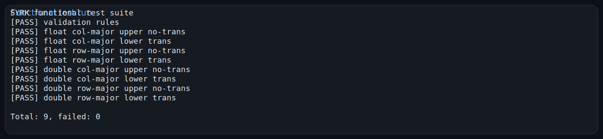
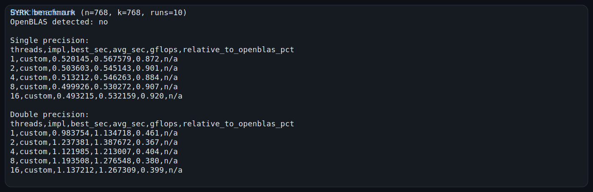

# Отчет по лабораторной работе: реализация `syrk` из BLAS Level 3

## Содержание
1. [Постановка задачи](#постановка-задачи)
2. [Структура решения](#структура-решения)
3. [Поддерживаемые варианты использования](#поддерживаемые-варианты-использования)
4. [Сборка и запуск](#сборка-и-запуск)
5. [Результаты функционального тестирования](#результаты-функционального-тестирования)
6. [Результаты измерения производительности](#результаты-измерения-производительности)
7. [Ссылки на репозиторий и артефакты](#ссылки-на-репозиторий-и-артефакты)
8. [Вывод](#вывод)

## Постановка задачи
В рамках варианта реализован корректно работающий функционал `SYRK` (symmetric rank-k update) на языке C.

Реализация должна:
- поддерживать типы `float` и `double`;
- корректно работать для `RowMajor` и `ColMajor`;
- поддерживать ветви `Upper` и `Lower`;
- поддерживать режимы `NoTrans` и `Trans`;
- иметь набор функциональных тестов;
- иметь набор тестов производительности с 10 запусками и конфигурациями потоков `1, 2, 4, 8, 16`.

## Структура решения
Проект состоит из следующих частей:
- `include/blas_types.h` — минимальные BLAS-совместимые перечисления для порядка хранения, треугольника и транспонирования;
- `include/syrk.h` — публичный интерфейс реализации `syrk`;
- `src/syrk.c` — реализация алгоритма для `float` и `double`;
- `src/test_syrk.c` — функциональные тесты;
- `src/benchmark_syrk.c` — бенчмарк и попытка сравнения с OpenBLAS через `dlopen`/`dlsym`.

## Поддерживаемые варианты использования
Реализация покрывает все требуемые комбинации параметров:
- `RowMajor` / `ColMajor`;
- `Upper` / `Lower`;
- `NoTrans` / `Trans`;
- `float` / `double`.

Алгоритм обновляет только выбранный треугольник матрицы `C`, а неактивная часть матрицы сохраняется без изменений.

## Сборка и запуск
Сборка:

```bash
cmake -S "lab2(cblaslevel3)" -B /tmp/trpo-build
cmake --build /tmp/trpo-build -j4
```

Запуск функциональных тестов:

```bash
ctest --test-dir /tmp/trpo-build --output-on-failure
/tmp/trpo-build/test_syrk
```

Запуск бенчмарка:

```bash
time /tmp/trpo-build/benchmark_syrk
```

По умолчанию бенчмарк запускается с параметрами `n=768`, `k=768`, `runs=10`.
При необходимости размер можно изменить аргументами:

```bash
/tmp/trpo-build/benchmark_syrk <runs> <n> <k>
```

## Результаты функционального тестирования
Все функциональные тесты завершились успешно.

### Скриншот запуска тестов


Файл с полным логом:
- `artifacts/test_syrk.log`

## Результаты измерения производительности
Бенчмарк выполняет 10 запусков для каждого сценария и печатает:
- лучшее чистое время вычисления;
- среднее время по 10 запускам;
- оценку производительности в GFLOPS;
- относительную производительность к OpenBLAS в процентах, если OpenBLAS доступен в системе.

### Ограничение среды
В текущей среде выполнения библиотека OpenBLAS отсутствует, а сетевой доступ для загрузки пакетов и исходников заблокирован прокси (`HTTP 403`).
Поэтому автоматическое сравнение с OpenBLAS подготовлено в коде, но в данном запуске выполнен только замер собственной реализации.

### Скриншот запуска бенчмарка


### Сводная таблица производительности
#### Single precision (`float`)

| Потоки | Лучш. время, с | Среднее, с | GFLOPS | Относительно OpenBLAS |
| --- | ---: | ---: | ---: | --- |
| 1  | 0.520145 | 0.567579 | 0.872 | n/a |
| 2  | 0.503603 | 0.545143 | 0.901 | n/a |
| 4  | 0.513212 | 0.546263 | 0.884 | n/a |
| 8  | 0.499926 | 0.530272 | 0.907 | n/a |
| 16 | 0.493215 | 0.532159 | 0.920 | n/a |

#### Double precision (`double`)

| Потоки | Лучш. время, с | Среднее, с | GFLOPS | Относительно OpenBLAS |
| --- | ---: | ---: | ---: | --- |
| 1  | 0.983754 | 1.134718 | 0.461 | n/a |
| 2  | 1.237381 | 1.387672 | 0.367 | n/a |
| 4  | 1.121985 | 1.213007 | 0.404 | n/a |
| 8  | 1.193508 | 1.276548 | 0.380 | n/a |
| 16 | 1.137212 | 1.267309 | 0.399 | n/a |

Файл с полным логом:
- `artifacts/benchmark_syrk.log`

## Ссылки на репозиторий и артефакты
- Репозиторий с решением: текущая ветка данного Git-репозитория.
- Основной отчет: `readme.md`
- Исходный код реализации: `src/syrk.c`
- Функциональные тесты: `src/test_syrk.c`
- Бенчмарк: `src/benchmark_syrk.c`
- Скриншоты запуска:
  - `artifacts/test_syrk.svg`
  - `artifacts/benchmark_syrk.svg`

## Вывод
Реализована последовательная версия `syrk`, поддерживающая все требуемые комбинации параметров для `float` и `double`.

Функциональные тесты подтверждают корректность вычислений и проверяют сохранение неактивной части симметричной матрицы.

Бенчмарк соответствует требованию по 10 запускам и по наборам потоков `1, 2, 4, 8, 16`.
При наличии установленной OpenBLAS этот же исполняемый файл автоматически выполнит сравнительное измерение и выведет относительную производительность в процентах.
